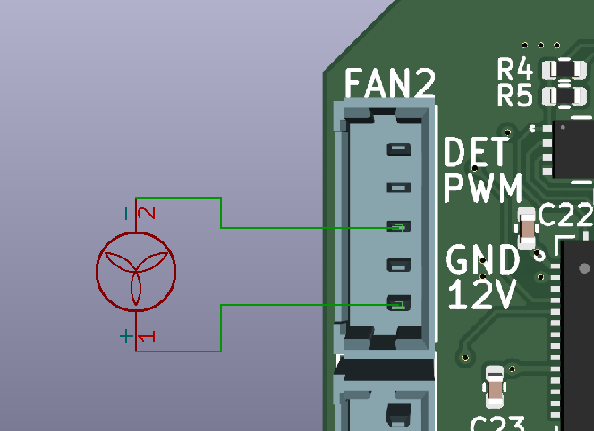
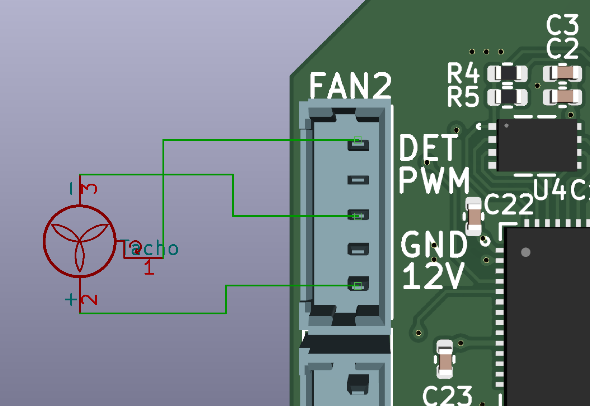
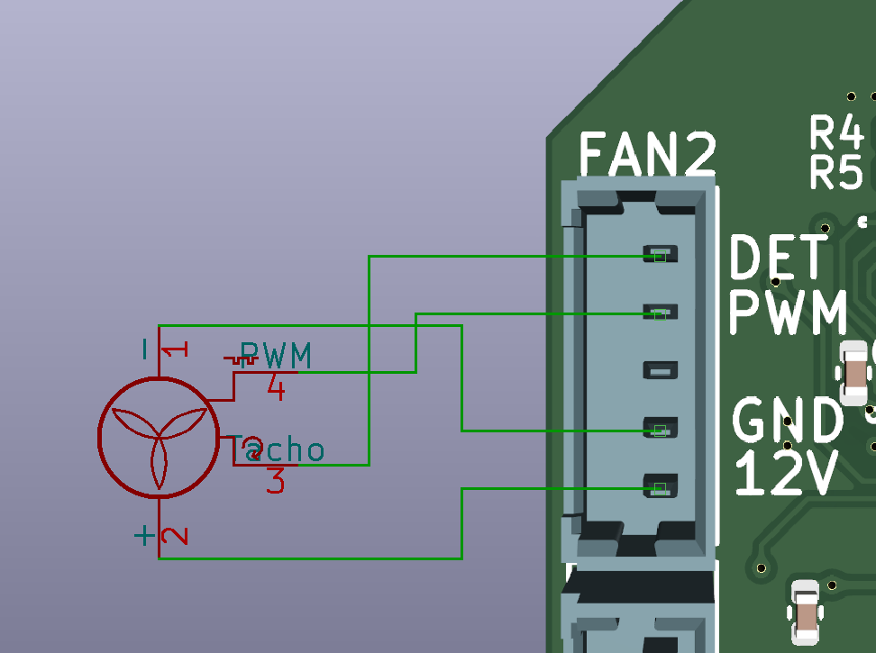

# Fan Wiring

There are five pins in connecter, they are

* frequency generation waveform input
* PWM **signal** output
* PWM **power** output
* ground
* power

For those fans they have own PWM signal input, the PWM **power** output is unused

# 2 Wires

# 3 Wires

# 4 Wires

