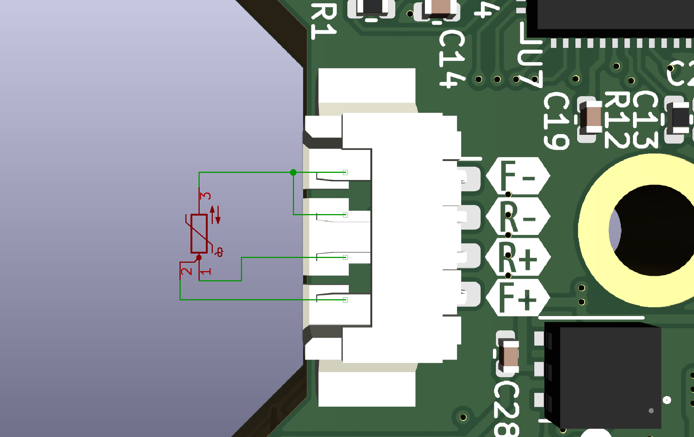
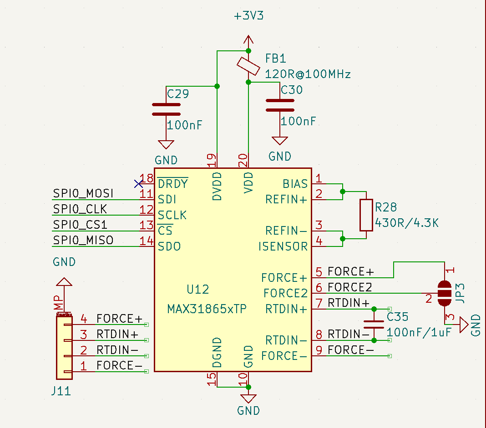

# For Different Wire Number

## 2 Wires
connect Force2 to ground, they are pin2&3 for the jumper

## 3 Wires
connect Force2 to Force+, they are pin1&2 for the jumper

## 4 Wires
connect Force2 to ground, they are pin2&3 for the jumper

# For Different RTD Value

the R28 in picthre is reference resistor, C35 is the Capacitor

Please choose High-quality, High-precision and Low-temperature-drift resistor

But actually a normal 1% resistor work well too

| RTD | Resistance | Capacitance |
|-----|-----|------|
|PT100 | 430R|100nF|
|PT1000|4.3K|1uF|
