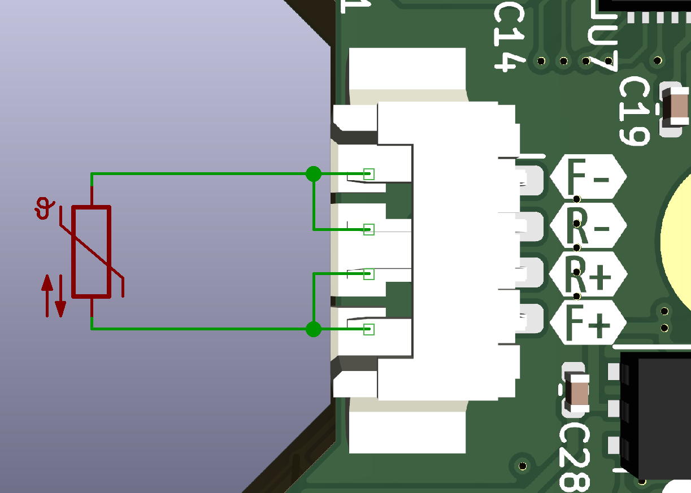
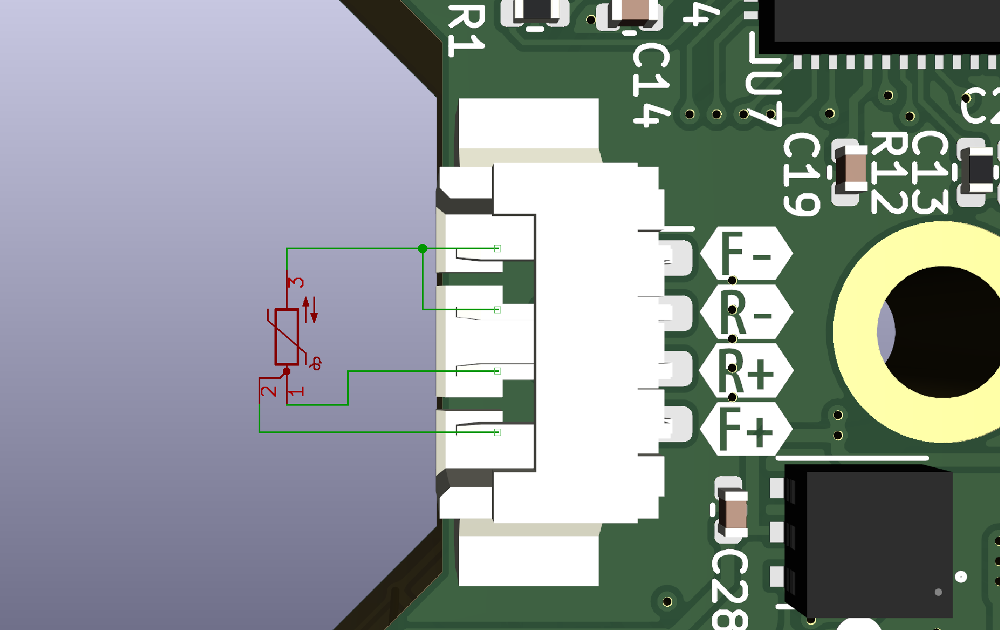
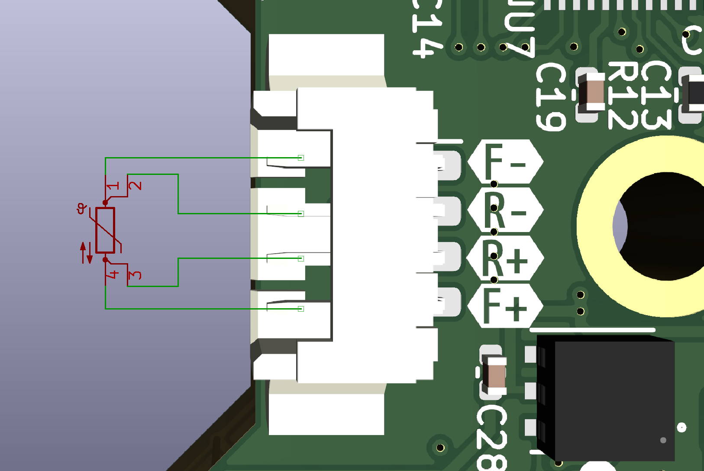
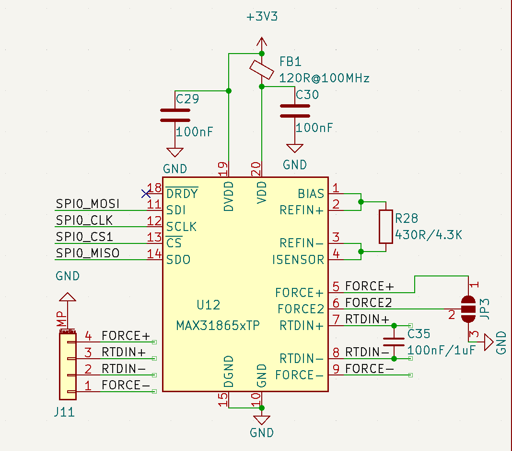

# 不同线制
## 2线
短接Force2到地，即跳线23脚
如图连接

## 3线
短接Force2到Force+，即跳线12脚
如图连接

## 4线
短接Force2到地，即跳线23脚
如图连接

# 不同铂电阻阻值

图中R28为参考电阻，C35为电容
参考电阻请选择高质量、高精度、低温漂的电阻，当然预算有限1%又不是不能用

| 类型 | 阻值 | 容值 |
|-----|-----|------|
|PT100 | 430R|100nF|
|PT1000|4.3K|1uF|
