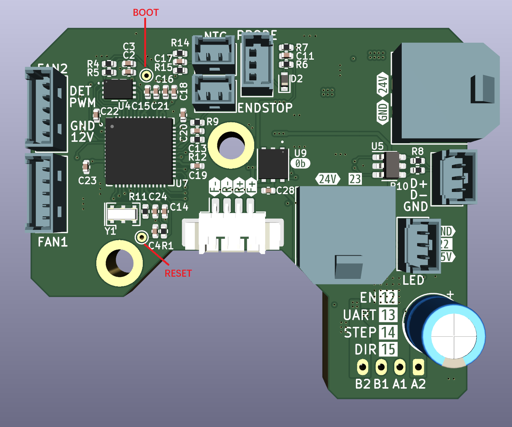

# Programming

The board has two testpoints, they are for boot select and reset

Connecting the boot testpoint to ground makes mcu boot from bootloader

Connecting the reset testpoint to ground makes mcu reset

Check [User Manual of BigTreeTech SKR-PICO](https://github.com/bigtreetech/SKR-Pico) for more information
